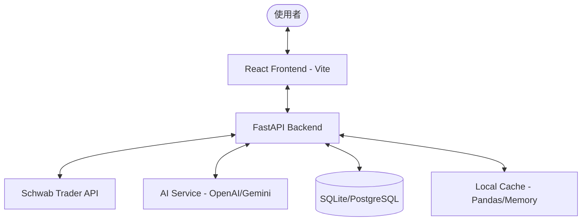

# SAID 系統架構與設計說明 (Overview)

## 1. 系統架構圖


## 2. 資料夾結構推薦
為了保持專案清晰，建議採用以下結構：

```text
嘉信股票儀表板/
├── backend/                # Python FastAPI 後端
│   ├── app/
│   │   ├── api/            # API 路由 (v1)
│   │   ├── core/           # 設定 (config), 安全 (security)
│   │   ├── models/         # 資料庫模型 (SQLAlchemy)
│   │   ├── schemas/        # Pydantic 模式
│   │   ├── services/       # 業務邏輯 (Schwab API 封裝, AI 邏輯)
│   │   ├── utils/          # 金融計算 (Risk metrics), 輔助工具
│   │   └── main.py         # 進入點
│   ├── tests/              # 後端測試
│   └── requirements.txt    # 相依套件
├── frontend/               # React 前端
│   ├── src/
│   │   ├── api/            # API 串接 (Axios/React Query)
│   │   ├── components/     # 共用組件 (Cards, Tables)
│   │   ├── features/       # 各功能模組 (Dashboard, Portfolio, Risk)
│   │   ├── hooks/          # 自定義 Hooks
│   │   ├── layout/         # 佈局組件
│   │   ├── store/          # 狀態管理 (Zustand/Redux)
│   │   └── types/          # TypeScript 定義
│   ├── tailwind.config.js
│   └── package.json
├── docs/                   # 文件 (如架構圖、API 規格)
├── venv/                   # Python 虛擬環境 (Git 忽略)
├── .gitignore
├── PROJECT_BRIEF.md
└── todo_progress.md
```

## 3. 核心模組說明
- **Auth Module**: 處理 OAuth 2.0 授權碼流程，儲存加密後的 Access/Refresh Tokens。
- **Risk Engine**: 利用 `backend/app/utils/risk.py` 進行組合波動率與 VaR 計算。
- **AI Copilot**: 整合 LLM，將持倉數據 (格式化後) 傳送給 AI 進行分析。
- **Mock Service**: 在後端實作一組模擬數據生產器，當 `DEMO_MODE=true` 時不調用真實 API。
